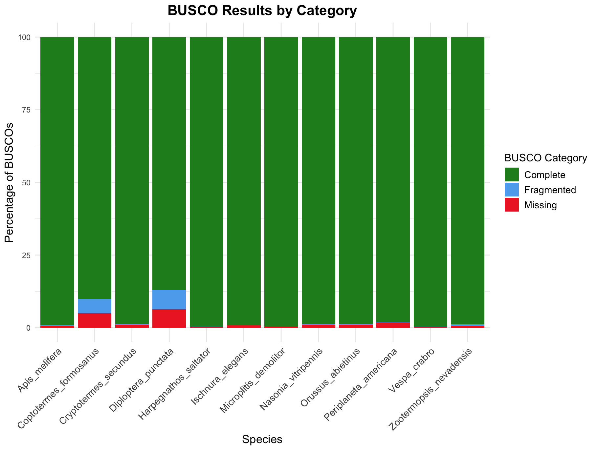
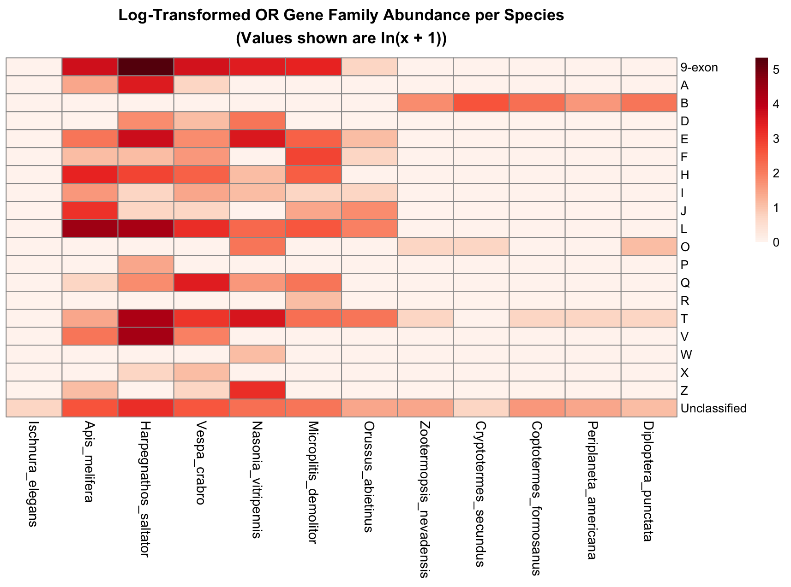
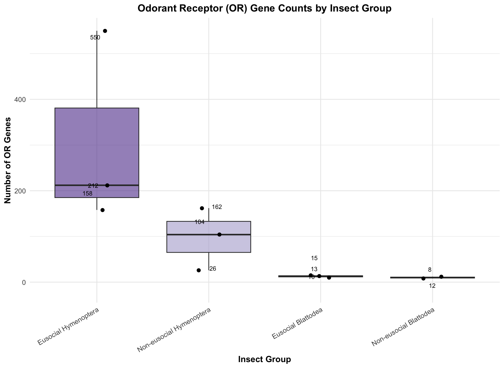

# **Comparative analysis of odorant receptor (OR) genes in eusocial and non-eusocial Hymenoptera and Blattodea**
#### *Savanna Brown, Weijun Liang, Tyler Elias*<br><br>

## **Introduction**

In animals, eusociality is a complex and extreme social structure defined by having three characteristics: reproductive division of labor (castes), cooperative care of young, and overlapping generations (Wilson and Hölldobler, 2005). In these societies, some individuals forgo personal reproduction to help rear the offspring of genetic relatives, a scenario often explained by inclusive fitness or kin selection theory (Eberhard, 1975). Inclusive fitness theory holds that genes driving behaviors which enhance the reproductive success of close relatives can proliferate (Eberhard, 1975). Kin selection, a kind of selection that favors a trait due to its positive effects on the reproductive success of kins, is therefore regarded as a primary mechanism enabling the evolution of eusociality (Eberhard, 1975).

Eusocial insects mainly occur in the orders Hymenoptera and Blattodea (Hölldobler and Wilson, 1990; Ross and Matthew, 2018; Thorne, 1997). Within Hymenoptera (bees, wasps, ants), eusociality has evolved multiple times: many bees and wasps are eusocial, and all ants are eusocial (Hölldobler and Wilson, 1990; Ross and Matthew, 2018). In Blattodea, termites are eusocial cockroaches and live in large colonies with a queen, king, sterile workers, and soldiers (Thorne, 1997). By contrast, typical cockroaches lack the three characteristics of eusociality (Bell et al., 2007). Therefore, eusocial Blattodea (termites) form true colonies with castes, whereas non-social Blattodea (cockroaches) do not.

Insect eusociality depends critically on chemical communication. Social insects use pheromones and other odorant cues to recognize nestmates, mark trails, regulate caste behavior, and coordinate many aspects of colony life (Zhou et al., 2015). In the sensilla of antennae, odorant receptors (ORs) are membrane proteins in the olfactory sensory neurons that detect volatile compounds (Steinbrecht, 2007; Zhou et al., 2015). Each OR is tuned to specific chemicals, and OR signals are processed in the brain’s antennal lobes, and notably, ORs are essential for sensing chemical cues from nestmates and castes (Steinbrecht, 2007; Zhou et al., 2015). Because chemosensation is so central to eusocial behavior, sophisticated OR repertoires have been hypothesized to underpin social life (Zhou et al., 2015).

Building on this idea, genomic studies found that some eusocial insects possess very large OR gene families. For example, sequenced ant and honeybee genomes revealed some of the largest OR repertoires known in insects. Zhou et al. (2015) reported widespread chemoreceptor gene expansions in ants and bees and suggested that these expansions likely facilitated the transition to eusociality. In particular, certain OR subfamilies (such as the 9-exon subfamily) are greatly expanded in ants and social bees and have been proposed to mediate kin recognition and pheromone communication in eusocial Hymenoptera (Zhou et al., 2015). This led to the expectation that eusocial species might in general maintain more OR genes than non-social relatives.

However, recent broad comparisons challenge the simple link between eusociality and OR gene count. Gautam et al. (2024) found no evidence to support that OR repertoires in Hymenoptera are linked to the evolution of eusociality. Instead, being wingless might shape the expansion of OR genes. Thus, the relationship between OR gene family size and eusocial lifestyle remains an open question. Furthermore, few studies have tackled the OR gene count in eusocial Blattodea, and it is unclear whether eusociality in this order is also associated with relatively large OR gene repertoires.<br><br>

### Research Question, Hypothesis, and Objective

**Research question: Is there a correlation between the number of odorant receptor (OR) genes and eusociality in Hymenoptera and Blattodea?**

To answer our research question, we compare OR gene counts across Hymenoptera and Blattodea. 

We hypothesize that eusocial taxa will exhibit larger OR repertoires across 19 OR subfamilies than non-eusocial taxa. <br><br>

### Study System
To explore the relationship between odorant receptor (OR) gene repertoires and eusociality, we selected representative species from four focal categories:
- **Eusocial Hymenoptera**
- **Non-eusocial Hymenoptera**
- **Eusocial Blattodea (termites, formerly order Isoptera)**
- **Non-eusocial Blattodea (cockroaches)**

An outgroup species from Odonata was also included for comparative purposes. Species were chosen based on the availability of high-quality annotated proteomes from NCBI.<br>

| **Category**               | **Species**                                                                 |
|---------------------------|------------------------------------------------------------------------------|
| Eusocial Hymenoptera      | *Apis mellifera* (Western honeybee) <a href="https://www.ncbi.nlm.nih.gov/datasets/genome/GCF_003254395.2/" target="_blank">NCBI link</a><br>*Harpegnathos saltator* (jumping ant) <a href="https://www.ncbi.nlm.nih.gov/datasets/genome/GCF_003227715.2/" target="_blank">NCBI link</a><br>*Vespa crabro* (European hornet) <a href="https://www.ncbi.nlm.nih.gov/datasets/genome/GCF_910589235.1/" target="_blank">NCBI link</a>|
| Non-eusocial Hymenoptera  | *Nasonia vitripennis* (jewel wasp) <a href="https://www.ncbi.nlm.nih.gov/datasets/genome/GCF_009193385.2/" target="_blank">NCBI link</a><br>*Microplitis demolitor* (braconid parasitoid wasp) <a href="https://www.ncbi.nlm.nih.gov/datasets/genome/GCF_026212275.2/" target="_blank">NCBI link</a><br>*Orussus abietinus* (parasitic wood wasp) <a href="https://www.ncbi.nlm.nih.gov/datasets/genome/GCF_000612105.2/" target="_blank">NCBI link</a>|
| Eusocial Blattodea        | *Zootermopsis nevadensis* (dampwood termite) <a href="https://www.ncbi.nlm.nih.gov/datasets/genome/GCF_000696155.1/" target="_blank">NCBI link</a><br>*Cryptotermes secundus* (drywood termite) <a href="https://www.ncbi.nlm.nih.gov/datasets/genome/GCF_002891405.2/" target="_blank">NCBI link</a><br>*Coptotermes formosanus* (Formosan subterranean termite) <a href="https://www.ncbi.nlm.nih.gov/datasets/genome/GCA_013340265.1/" target="_blank">NCBI link</a>|
| Non-eusocial Blattodea    | *Periplaneta americana* (American cockroach) <a href="https://www.ncbi.nlm.nih.gov/datasets/genome/GCF_040183065.1/" target="_blank">NCBI link</a><br>*Diploptera punctata* (Pacific beetle cockroach) <a href="https://www.ncbi.nlm.nih.gov/datasets/genome/GCA_030220185.1/" target="_blank">NCBI link</a>|
| Outgroup                  | *Ischnura elegans* (blue-tailed damselfly) <a href="https://www.ncbi.nlm.nih.gov/datasets/genome/GCF_921293095.1/" target="_blank">NCBI link</a><br>                                 


All eusocial species have clear reproductive and non-reproductive caste systems, whereas their listed non-social relatives lack such division of labor. By surveying OR gene family sizes in each of these taxa, **we aim to determine whether a consistent expansion of OR genes accompanies the evolution of eusociality in both orders.** <br><br>

<br><br>

## Workflow <br>

### **Data Collection**

We searched NCBI for each target species to ensure that a predicted proteome in FASTA format was available for download. Each protein fasta was downloaded directly from NCBI  using a wget command and the FTP links. <br>


```bash
# wget download for the outgroup protein dataset; the same method is used for downloading all the other samples
wget https://ftp.ncbi.nlm.nih.gov/genomes/all/GCF/921/293/095/GCF_921293095.1_ioIscEleg1.1/GCF_921293095.1_ioIscEleg1.1_protein.faa.gz
```
<br>

### **Quality Control**

To assess completeness of selected proteomes, we ran **BUSCO** (Benchmarking Universal Single-Copy Orthologs) on each protein FASTA file using the `insecta_odb10` database.

```
module load busco

# Define directories and database
GENOME_DIR="/home/FCAM/eeb5300/usr3/GROUP_PROJECT/pep_assemblies"
BUSCO_DIR="/home/FCAM/eeb5300/usr3/GROUP_PROJECT/BUSCO"
LINEAGE="/isg/shared/databases/BUSCO/odb10/lineages/insecta_odb10"

# Create BUSCO results directory if it doesn't exist
mkdir -p ${BUSCO_DIR}

# Change to the BUSCO results directory
cd ${BUSCO_DIR}

# Loop through each genome file that ends with ".fna" and run BUSCO
for genome_file in ${GENOME_DIR}/*.faa; do
  base_name=$(basename ${genome_file})
  output_name=$(echo ${base_name} | cut -d'_' -f1,2)

  # Run BUSCO
  echo "Running BUSCO on ${genome_file}"
  busco -i ${genome_file} -o ${output_name}_busco -l ${LINEAGE} -m protein -c 8 -f

  echo "BUSCO analysis complete for ${genome_file}. Results saved to ${BUSCO_DIR}/${output_name}_busco"
done

```
<br>


 All selected proteomes had a BUSCO completeness score greater than 85% and were considered sufficient for downstream analysis. <br><br>
 

### BUSCO Summary




<br><br>
#### OR Gene Screening

We also used **DIAMOND** (v2.1.8; Buchfink et al., 2021) to perform sequence similarity searches of OR genes in our selected proteomes. A DIAMOND database was built from a curated set of *Polistes* odorant receptor (OR) proteins from Legan et al. (2021). Each target species’ protein FASTA file was aligned against this database using the `blastp` mode with default parameters to identify putative OR genes. <br><br>


#### Diamond databasing of curated Polistes OR protein set

```bash
module load diamond/2.1.8

diamond makedb --in polistes_OR_protein_sequences.fasta \
               --db Polistes_OR_Protein_Sequences.dmnd \
               --threads 16
```
<br>

#### Similarity search - screen for OR genes

```bash
module load diamond/2.1.8

# Define paths
DB="/home/FCAM/eeb5300/usr3/GROUP_PROJECT/Polistes_OR_Protein_Sequences.dmnd"  
INPUT_DIR="/home/FCAM/eeb5300/usr3/GROUP_PROJECT/pep_assemblies"  
OUTPUT_DIR="/home/FCAM/eeb5300/usr3/GROUP_PROJECT/DIAMOND_SCREEN_RESULTS"

# Loop through all .faa files in the input directory and run DIAMOND BLASTP
for QUERY in $INPUT_DIR/*.faa; do
    # Extract the base name of the input file (e.g., file1.faa -> file1)
    BASENAME=$(basename $QUERY .faa)
    
    # Define the output file for this query
    OUT="$OUTPUT_DIR/${BASENAME}_vs_pep_database.tsv"
    
    # Run DIAMOND BLASTP
    echo "Running DIAMOND BLASTP for $QUERY..."
    diamond blastp \
        --db $DB \
        --query $QUERY \
        --out $OUT \
        --outfmt 6 qseqid sseqid pident length evalue bitscore qseq sseq \
        --threads 16
    echo "DIAMOND BLASTP completed for $QUERY. Output saved to $OUT."
done
```
<br>

All selected proteomes showed successful OR gene retrieval with this method, indicating that our chosen input data is sufficient for downstream analysis. 
<br><br>


### **OrthoFinder**

OrthoFinder is a comparative genomics tool that identifies orthogroups by combining sequence similarity searches, gene tree inference, and species tree construction (Emms & Kelly, 2017). It begins with an all-vs-all sequence search across protein FASTA files from all species, clusters homologous genes into orthogroups, and then reconstructs gene trees for each orthogroup. It also infers a rooted species tree and maps gene duplication events onto the tree by comparing the topology of gene trees and the species tree, ultimately giving key information about how genes are related both among and within species.

For this project, we ran OrthoFinder (v2.5.4) using predicted protein sequences from our selected hymenopteran and non-hymenopteran species to define orthogroups across lineages. 


```bash
module load OrthoFinder/2.5.4
module load mafft/7.471 FastME/2.1.5 RAxML/8.2.11 fasttree/2.1.10

# input directory
ORTHO_INPUT="/home/FCAM/eeb5300/usr3/GROUP_PROJECT/ORTHOFINDER_INPUT"

# path to OF python script on cluster
ORTHOFINDER="/isg/shared/apps/OrthoFinder/2.5.4/OrthoFinder_source/orthofinder.py"

python $ORTHOFINDER -f $ORTHO_INPUT/ \
-t 16 \
-a 16 \
-M msa \
-A mafft \
-T fasttree \
-S diamond \
-n OrthoFinder_run1
```
<br><br>


### Diamond Similarity Search

These orthogroups served as the basis for identifying candidate odorant receptor (OR) gene families. To identify putative OR gene families, we used our DIAMOND database of curated *Polistes* OR proteins to perform a similarity search against the longest representative protein sequence of each orthogroup.
<br>

#### Longest Representative Protein Pull

```bash
OUTPUT_FILE="/home/FCAM/eeb5300/usr3/GROUP_PROJECT/DIAMOND_OGs/longest_per_orthogroup.fasta"
INPUT_DIR="/home/FCAM/eeb5300/usr3/GROUP_PROJECT/ORTHOFINDER_INPUT/OrthoFinder/Results_OrthoFinder_run1/Orthogroup_Sequences"

# loop through each orthogroup file
for FILE in "$INPUT_DIR"/*.fa; do
    BASENAME=$(basename "$FILE" .fa)  # Extract the orthogroup ID

    # extract the longest sequence
    awk -v og="$BASENAME" '
    /^>/ { 
        if (seq) { 
            if (length(seq) > max_len) { 
                max_len = length(seq); 
                longest_header = header; 
                longest_seq = seq; 
            } 
        } 
        header = $0; seq = ""; next 
    } 
    { seq = seq $0 } 
    END { 
        if (length(seq) > max_len) { 
            longest_header = header; 
            longest_seq = seq; 
        } 
        print ">" og "_" substr(longest_header, 2) "\n" longest_seq 
    }' "$FILE" >> $OUTPUT_FILE
done
```
<br>


#### Diamond blastp

```bash
module load diamond/2.1.8 

DB="/home/FCAM/eeb5300/usr3/GROUP_PROJECT/DIAMOND_screen/Polistes_OR_Protein_Sequences.dmnd"  # db
INPUT="/home/FCAM/eeb5300/usr3/GROUP_PROJECT/DIAMOND_OGs/longest_per_orthogroup.fasta"  # input
OUT="/home/FCAM/eeb5300/usr3/GROUP_PROJECT/DIAMOND_OGs/OG_hits.tsv"  # output

diamond blastp \
    --db $DB \
    --query $INPUT \
    --out $OUT \
    --outfmt 6 qseqid sseqid pident length evalue bitscore qseq sseq \
    --threads 8
```
<br>

#### Setting alignment quality thresholds
Alignment results were filtered based on alignment quality thresholds of e-value less than 1e-10 and an alignment percent identity greater than or equal to 30%. These thresholds were chosen after exploring results and finding an ideal balance of data preservation while eliminating noise from lower quality hits that made 1:1 orthogroup:OR gene family calls unclear.
 
```bash
# get a clean summary of ther diamond results to see what families hit to what OGs
awk -F'\t' '{split($2, a, "_"); print $1 "\t" a[2]}' /home/FCAM/eeb5300/usr3/GROUP_PROJECT/DIAMOND_OGs/OG_hits.tsv > /home/FCAM/eeb5300/usr3/GROUP_PROJECT/DIAMOND_OGs/OG_hits_all_summary.tsv


# filter the DIAMOND output by e-value (e-value < 1e-10) and coverage ( >= 30% percent ID)
awk '$3 >= 30 && $5 < 1e-10' /home/FCAM/eeb5300/usr3/GROUP_PROJECT/DIAMOND_OGs/OG_hits.tsv > /home/FCAM/eeb5300/usr3/GROUP_PROJECT/DIAMOND_OGs/OG_hits_filtered.tsv


# get summary of filtered results to see what families hit to what OGs
awk -F'\t' '{split($2, a, "_"); print $1 "\t" a[2]}' /home/FCAM/eeb5300/usr3/GROUP_PROJECT/DIAMOND_OGs/OG_hits_filtered.tsv > /home/FCAM/eeb5300/usr3/GROUP_PROJECT/DIAMOND_OGs/OG_hits_filtered_summary.tsv
```

<br>

#### **Gene Family Calls**

Even with the alignment thresholds applied, some orthogroups matched to multiple OR gene families, complicating the ability to assign a clean 1:1 match between orthogroup and gene family.

To address this, we implemented a classification scheme based on the following rules:

- **Single-hit orthogroups**: Orthogroups that matched only one OR gene family were classified as that family.
- **One-outlier orthogroups**: Orthogroups where all but one match belonged to the same gene family were classified as the majority (non-outlier) family.
- **Multi-family or ambiguous orthogroups**: Orthogroups with matches to more than one outlier or more than two gene families were labeled as **"Unclassified"**.

An awk script was used to execute this classification using if/else logic:
<br>

```bash
awk -F'\t' '{
    counts[$1][$2]++;  # count occurrences of each family (col 2) for each orthogroup (col 1)
    total[$1]++;       # track total hits for each orthogroup
} END {
    for (og in counts) {
        max_count = 0;
        majority_family = "";
        unique_families = 0;

        # determine the majority family and count unique families
        for (family in counts[og]) {
            unique_families++;
            if (counts[og][family] > max_count) {
                max_count = counts[og][family];
                majority_family = family;
            }
        }

        # decide classification based on the rules
        if (unique_families == 1) {
            print og "\t" majority_family;  # all hits same
        } else if (max_count == total[og] - 1) {
            print og "\t" majority_family;  # one outlier
        } else {
            print og "\tUnclassified";     # unclassified
        }
    }
}' /home/FCAM/eeb5300/usr3/GROUP_PROJECT/DIAMOND_OGs/OG_hits_filtered_summary.tsv > /home/FCAM/eeb5300/usr3/GROUP_PROJECT/DIAMOND_OGs/OG_hits_classified.tsv
```

<br><br>

#### **Subsetting into final DF**

Finally, these orthogroup to OR gene family identities were merged with orthogroup gene copy number data from Orthofinder to create a final data frame with gene copy number for each OR gene family for each species.
<br>


```bash
 subet the OG output gene counts file to only the OGs that are in the OR gene family summary
awk 'NR==FNR {  # Process the classified file first
   split($1, a, "_");  # Extract the orthogroup part before the first underscore
   orthogroups[a[1]];  # Store the orthogroup in an array
   next;
}
FNR == 1 || $1 in orthogroups {  # Print the header (FNR == 1) or matching orthogroups
   print;
}' /home/FCAM/eeb5300/usr3/GROUP_PROJECT/DIAMOND_OGs/OG_hits_classified.tsv \
  /home/FCAM/eeb5300/usr3/GROUP_PROJECT/ORTHOFINDER_INPUT/OrthoFinder/Results_OrthoFinder_run1/Orthogroups/Orthogroups.GeneCount.tsv \
  > /home/FCAM/eeb5300/usr3/GROUP_PROJECT/DIAMOND_OGs/Orthogroups.GeneCount_subset.tsv

  # add in family names to this count summary
awk 'NR==FNR {  # Process the classified file first
   split($1, a, "_");  # Extract the orthogroup name only, before the first underscore
   families[a[1]] = $2;  # Store the family name in an array
   next;
}
FNR == 1 {  # For the gene count file, print the header with an added "Family" column
   print "Orthogroup\tFamily\t" substr($0, index($0, "\t") + 1);
   next;
}
$1 in families {  # For matching orthogroups, add the family name as the second column
   print $1 "\t" families[$1] "\t" substr($0, index($0, "\t") + 1);
}' /home/FCAM/eeb5300/usr3/GROUP_PROJECT/DIAMOND_OGs/OG_hits_classified.tsv \
  /home/FCAM/eeb5300/usr3/GROUP_PROJECT/DIAMOND_OGs/Orthogroups.GeneCount_subset.tsv \
  > /home/FCAM/eeb5300/usr3/GROUP_PROJECT/DIAMOND_OGs/Family_GeneCount_Summary.csv
```
<br><br>


### **Figure 1: Gene Family Dot Plot with Phylogeny**
<br>

**R code to generate dot plot:**

```r
# DOT PLOT R CODE
library(ggplot2)
library(tidyverse)

# Load and reshape data
OR_family_counts <- read.csv("Family_GeneCount_Summary.csv", header = TRUE, row.names = "Family")
OR_family_counts2 <- OR_family_counts %>% rownames_to_column(var = "GeneFamily")
OR_family_counts_long <- OR_family_counts2 %>% pivot_longer(cols = -GeneFamily, names_to = "Species", values_to = "GeneCount")

# Clean up and reorder
species_order <- c("Ischnura elegans", "Cryptotermes secundus", "Coptotermes formosanus", "Zootermopsis nevadensis",
                   "Periplaneta americana", "Diploptera punctata", "Harpegnathos saltator", "Apis melifera",
                   "Vespa crabro", "Nasonia vitripennis", "Microplitis demolitor", "Orussus abietinus")
OR_family_counts_long$Species <- gsub("\\.", " ", OR_family_counts_long$Species)
OR_family_counts_long$Species <- factor(OR_family_counts_long$Species, levels = species_order)

# Assign groups
OR_family_counts_long <- OR_family_counts_long %>%
  mutate(Group = case_when(
    Species == "Ischnura elegans" ~ "Outgroup (Odonata)",
    Species %in% c("Apis melifera", "Harpegnathos saltator", "Vespa crabro") ~ "Eusocial Hymenoptera",
    Species %in% c("Nasonia vitripennis", "Microplitis demolitor", "Orussus abietinus") ~ "Non-eusocial Hymenoptera",
    Species %in% c("Zootermopsis nevadensis", "Cryptotermes secundus", "Coptotermes formosanus") ~ "Eusocial Blattodea",
    Species %in% c("Periplaneta americana", "Diploptera punctata") ~ "Non-eusocial Blattodea"
  ))

# Plot
ggplot(OR_family_counts_long, aes(x = GeneFamily, y = Species, size = GeneCount, color = Group)) +
  geom_point() +
  scale_size_continuous(range = c(1, 10)) +
  theme_minimal() +
  theme(
    axis.text.x = element_text(angle = 45, hjust = 1, size = 12),
    axis.text.y = element_text(face = "italic", size = 12),
    legend.text = element_text(size = 12),
    legend.title = element_text(size = 14)
  ) +
  xlab("Gene family") +
  ylab("") +
  labs(size = "Gene count")
```
<br><br>

This figure shows gene family sizes across species, grouped by sociality and order. The 9-exon family (leftmost column) is clearly expanded in eusocial Hymenoptera but not in Blattodea. Each point's size reflects gene count. The cladogram was manually constructed and is inferred based on previous phylogenetic findings (Bourguignon et al., 2014; Cheng et al., 2016; Djernaes et al., Peter et al., 2017; 2012; Shu et al., 2023; Tihelka et al., 2021).


<br>

---

### **Figure 2: Heatmap of OR Gene Families**
<br>

**R code to generate heatmap:**
```r

library(dplyr)
library(pheatmap)
library(RColorBrewer)

final_df <- read.csv("Family_GeneCount_Summary.csv", header = TRUE)

# Convert to matrix
gene_mat <- final_df %>%
  column_to_rownames("Family") %>%
  as.matrix()

# Define custom order
custom_row_order <- c("9-exon", sort(setdiff(rownames(gene_mat), c("9-exon", "Unclassified"))), "Unclassified")
custom_col_order <- c(
  "Ischnura_elegans",
  "Apis_melifera", "Harpegnathos_saltator", "Vespa_crabro",
  "Nasonia_vitripennis", "Microplitis_demolitor", "Orussus_abietinus",
  "Zootermopsis_nevadensis", "Cryptotermes_secundus", "Coptotermes_formosanus",
  "Periplaneta_americana", "Diploptera_punctata"
)

# Reorder and log-transform
gene_mat_ordered <- gene_mat[custom_row_order, custom_col_order]
log_gene_mat <- log(gene_mat_ordered + 1)

# Plot heatmap
pheatmap(log_gene_mat,
         scale = "none",
         cluster_cols = FALSE,
         cluster_rows = FALSE,
         color = colorRampPalette(brewer.pal(9, "Reds"))(100),
         display_numbers = FALSE,
         show_rownames = TRUE,
         show_colnames = TRUE,
         fontsize_col = 9,
         fontsize_row = 8,
         main = "Log-Transformed OR Gene Family Abundance per Species\n(Values shown are ln(x + 1))",
         labels_row = rownames(log_gene_mat),
         angle_col = 45)
```

<br><br>

This heatmap displays log-transformed copy numbers of odorant receptor genes across species and families. Eusocial Hymenoptera show expansion in multiple gene families, especially the 9-exon family (top row). In contrast, Blattodea species have fewer ORs overall, with no clear sociality-associated expansion.




<br>
---

### **Figure 3: Total OR Gene Counts by Group**

<br>

**R code to generate box plot:**
```r
library(ggplot2)

# Build species group annotation
col_group <- tibble(
  Species = custom_col_order,
  Group = c(
    "Outgroup",                        # Ischnura_elegans
    "Eusocial Hymenoptera",           # Apis_melifera
    "Eusocial Hymenoptera",           # Harpegnathos_saltator
    "Eusocial Hymenoptera",           # Vespa_crabro
    "Non-eusocial Hymenoptera",       # Nasonia_vitripennis
    "Non-eusocial Hymenoptera",       # Microplitis_demolitor
    "Non-eusocial Hymenoptera",       # Orussus_abietinus
    "Eusocial Blattodea",             # Zootermopsis_nevadensis
    "Eusocial Blattodea",             # Cryptotermes_secundus
    "Eusocial Blattodea",             # Coptotermes_formosanus
    "Non-eusocial Blattodea",         # Periplaneta_americana
    "Non-eusocial Blattodea"          # Diploptera_punctata
  )
)

# Sum total ORs per species
total_ors <- colSums(gene_mat)

# Merge totals with group annotation
col_group <- col_group %>%
  mutate(Total_ORs = total_ors[Species])

# Define group order and filter
group_order <- c(
  "Eusocial Hymenoptera",
  "Non-eusocial Hymenoptera",
  "Eusocial Blattodea",
  "Non-eusocial Blattodea"
)

col_group_filtered <- col_group %>%
  filter(Group %in% group_order) %>%
  mutate(Group = factor(Group, levels = group_order))

# Plot
ggplot(col_group_filtered, aes(x = Group, y = Total_ORs, fill = Group)) +
  geom_boxplot(alpha = 0.6, outlier.shape = NA) +
  geom_jitter(width = 0.1, size = 2) +
  geom_text(aes(label = Total_ORs),
            position = position_jitter(width = 0.1, height = 35),
            vjust = -0.5, size = 3) +
  scale_fill_manual(values = c(
    "Eusocial Hymenoptera" = "#5E3C99",
    "Non-eusocial Hymenoptera" = "#B2ABD2",
    "Eusocial Blattodea" = "#1B7837",
    "Non-eusocial Blattodea" = "#A6DBA0"
  )) +
  labs(
    title = "Odorant Receptor (OR) Gene Counts by Insect Group",
    x = "Insect Group",
    y = "Number of OR Genes"
  ) +
  theme_minimal(base_size = 12) +
  theme(
    plot.title = element_text(face = "bold", size = 14, hjust = 0.5),
    axis.title.x = element_text(face = "bold"),
    axis.title.y = element_text(face = "bold"),
    axis.text.x = element_text(angle = 30, hjust = 1),
    legend.position = "none"
  )
```
<br><br>

This boxplot compares total odorant receptor (OR) gene counts across eusocial and non-eusocial insects in Hymenoptera and Blattodea. Eusocial Hymenoptera show a clear expansion in total OR genes compared to their non-eusocial relatives. In contrast, there is no consistent difference in OR counts between eusocial and non-eusocial Blattodea.



<br><br>

## **Conclusions**


- Odorant receptor (OR) gene families show marked expansion in Hymenoptera, particularly among eusocial species. This supports previous work linking chemical communication with social complexity.
- In contrast, eusocial Blattodea (termites) do not exhibit similar OR gene expansions, suggesting that eusociality in this lineage may rely on other mechanisms.
- The 9-exon and L subfamilies are especially expanded in eusocial Hymenoptera, reinforcing their proposed roles in pheromone detection and social communication.
- *Harpegnathos saltator* (jumping ant) shows the highest total OR gene counts among sampled species, including notable expansions in the T and V subfamilies, which could reflect species-specific adaptations in chemosensation.


<br>

### **Challenges and potential pitfalls**

#### Data Availability
Eusociality is rare outside Hymenoptera, and eusocial non-Hymenopteran lineages are underrepresented in genomic datasets. This limits both the number of usable species per category and the taxonomic breadth of our comparative analyses.


#### Accurately Identifying OR Genes:
Homologous genes can exhibit extreme sequence and amino acid divergence due to deep evolutionary timescales. Here, we rely on OrthoFinder to accurately group genes into orthogroups despite this divergence, assuming that the gene trees that are created accurately reflect true evolutionary relationships. This assumption is unlikely true all the time, however, and it is possible that not all OR genes are captured in these orthogroups. 
Additionally, OR genes were identified by similarity search to a curated OR protein set from the Hymenopteran genus Polistes, which may bias detection toward Hymenoptera and overlook lineage-specific receptors in groups like Blattodea. A general lack of functional and genomic characterization of non-Hymenopteran OR genes is a barrier here, limiting the robustness of OR gene identification across all lineages.


<br><br>
## **Works Cited**
​Bell, W. J., Roth, L. M., & Nalepa, C. A. (2007). Cockroaches: ecology, behavior, and natural history. JHU Press.


Bourguignon, T., Lo, N., Cameron, S. L., Šobotník, J., Hayashi, Y., Shigenobu, S., ... & Evans, T. A. (2014). The evolutionary history of termites as inferred from 66 mitochondrial genomes. Molecular Biology and Evolution, 32(2), 406–421.


Buchfink, B., Reuter, K., & Drost, H. G. (2021). Sensitive protein alignments at tree-of-life scale using DIAMOND. Nature Methods, 18, 366–368.


Cheng, X. F., Zhang, L. P., Yu, D. N., Storey, K. B., & Zhang, J. Y. (2016). The complete mitochondrial genomes of four cockroaches (Insecta: Blattodea) and phylogenetic analyses within cockroaches. Gene, 586(1), 115–122.


Crowley, L. M., University of Oxford, Wellcome Genome Lab, Tree of Life, & Darwin Tree of Life Consortium. (2022). The genome sequence of the European hornet, Vespa crabro Linnaeus, 1758. Wellcome Open Research, 7, 27.


Cryptotermes secundus. Assembly: GCA_002891405.2 (GenBank). National Center for Biotechnology Information (NCBI), accessed April 2025. Available at: https://www.ncbi.nlm.nih.gov/assembly/GCA_002891405.2


Dalla Benetta, E., Antoshechkin, I., Yang, T., Nguyen, H. Q. M., Ferree, P. M., & Akbari, O. S. (2020). Genome elimination mediated by gene expression from a selfish chromosome. Science Advances, 6(14), eaaz9808.


Djernaes, M., Klass, K. D., Picker, M. D., & Damgaard, J. (2012). Phylogeny of cockroaches (Insecta, Dictyoptera, Blattodea), with placement of aberrant taxa and exploration of out‐group sampling. Systematic Entomology, 37(1), 65–83.


Dockman, R. L., Simmonds, T. J., Vogel, K. J., Geib, S. M., & Ottesen, E. A. (2025). Genome Report: Improved chromosome-level genome assembly of the American cockroach, Periplaneta americana. bioRxiv, 2025–03.


Eberhard, M. J. W. (1975). The evolution of social behavior by kin selection. The Quarterly Review of Biology, 50(1), 1–33.


Emms, D. M., & Kelly, S. (2019). OrthoFinder: phylogenetic orthology inference for comparative genomics. Genome Biology, 20, 238.


Fouks, B., Harrison, M. C., Mikhailova, A. A., Marchal, E., English, S., Carruthers, M., ... & Tobe, S. S. (2023). Live-bearing cockroach genome reveals convergent evolutionary mechanisms linked to viviparity in insects and beyond. iScience, 26(10).


Gautam, S., McKenzie, S., Katzke, J., Hita Garcia, F., Yamamoto, S., & Economo, E. P. (2024). Evolution of odorant receptor repertoires across Hymenoptera is not linked to the evolution of eusociality. Proceedings of the Royal Society B, 291(2031), 20241280.


Itakura, S., Yoshikawa, Y., Togami, Y., & Umezawa, K. (2020). Draft genome sequence of the termite, Coptotermes formosanus: Genetic insights into the pyruvate dehydrogenase complex of the termite. Journal of Asia-Pacific Entomology, 23(3), 666–674.


Legan, A. W., Jernigan, C. M., Miller, S. E., Fuchs, M. F., & Sheehan, M. J. (2021). Expansion and accelerated evolution of 9-exon odorant receptors in Polistes paper wasps. Molecular biology and evolution, 38(9), 3832-3846.


Manni, M., Berkeley, M. R., Seppey, M., & Zdobnov, E. M. (2021). BUSCO: Assessing genomic data quality and beyond. Current Protocols, 1, e323.


Microplitis demolitor. Assembly: GCF_026212275.2 (RefSeq). National Center for Biotechnology Information (NCBI), accessed April 2025. Available at: https://www.ncbi.nlm.nih.gov/assembly/GCF_026212275.2


Orussus abietinus. Assembly: GCF_000612105.2 (RefSeq). National Center for Biotechnology Information (NCBI), accessed April 2025. Available at: https://www.ncbi.nlm.nih.gov/assembly/GCF_000612105.2


Peters, R. S., Krogmann, L., Mayer, C., Donath, A., Gunkel, S., Meusemann, K., ... & Niehuis, O. (2017). Evolutionary history of the Hymenoptera. Current Biology, 27(7), 1013–1018.


Plants & Python Consortium. (2022). Plants & Python: A series of lessons in coding, plant biology, computation, and bioinformatics. The Plant Cell, 34(7), e1.


Price, B. W., Winter, M., Brooks, S. J., Natural History Museum Genome Lab, Wellcome Sanger Institute Tree of Life, & Darwin Tree of Life Consortium. (2022). The genome sequence of the blue-tailed damselfly, Ischnura elegans (Vander Linden, 1820). Wellcome Open Research, 7, 66.


Ross, K. G., & Matthews, R. W. (Eds.). (2018). The social biology of wasps. Cornell University Press.


Shields, E. J., Sheng, L., Weiner, A. K., Garcia, B. A., & Bonasio, R. (2018). High-quality genome assemblies reveal long non-coding RNAs expressed in ant brains. Cell Reports, 23(10), 3078–3090.


Steinbrecht, R. A. (2007). Structure and function of insect olfactory sensilla. In Ciba Foundation Symposium 200 – Olfaction in Mosquito‐Host Interactions (pp. 158–183). Chichester, UK: John Wiley & Sons, Ltd.


Terrapon, N., Li, C., Robertson, H. M., Ji, L., Meng, X., Booth, W., ... & Liebig, J. (2014). Molecular traces of alternative social organization in a termite genome. Nature Communications, 5(1), 3636.


Tihelka, E., Cai, C., Giacomelli, M., Lozano-Fernandez, J., Rota-Stabelli, O., Huang, D., ... & Pisani, D. (2021). The evolution of insect biodiversity. Current Biology, 31(19), R1299–R1311.


Wallberg, A., Bunikis, I., Pettersson, O. V., Mosbech, M. B., Childers, A. K., Evans, J. D., ... & Webster, M. T. (2019). A hybrid de novo genome assembly of the honeybee, Apis mellifera, with chromosome-length scaffolds. BMC Genomics, 20, 1–19.


Wilson, E. O., & Hölldobler, B. (2005). Eusociality: origin and consequences. Proceedings of the National Academy of Sciences, 102(38), 13367–13371.


Zhou, X., Rokas, A., Berger, S. L., Liebig, J., Ray, A., & Zwiebel, L. J. (2015). Chemoreceptor evolution in Hymenoptera and its implications for the evolution of eusociality. Genome biology and evolution, 7(8), 2407-2416.


